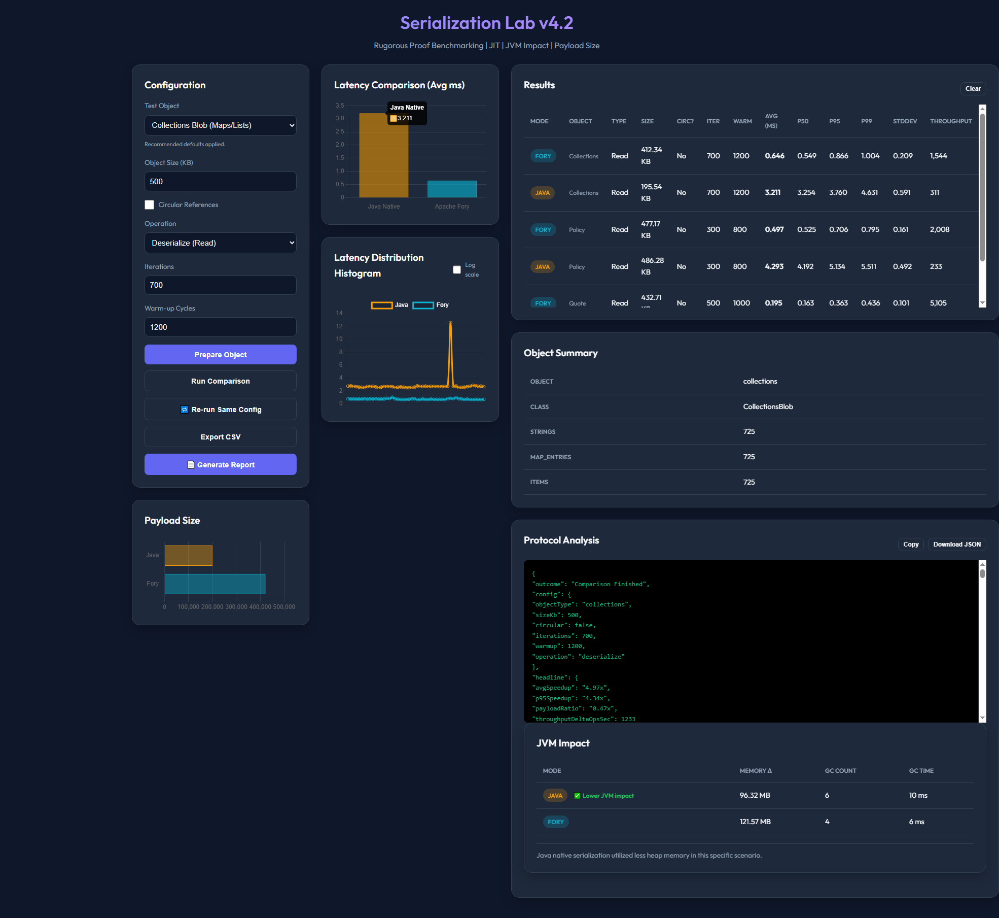

# Serialization Lab v4.2: Rigorous Performance Proof



This project is a high-performance benchmark laboratory designed to compare **Java Native Serialization** with **Apache Fory (formerly Apache Fury)** in a Spring Session (JDBC) environment. 

Version 4.1 introduces multi-object type support, allowing you to benchmark diverse data structures from simple quotes to deeply nested policies and map-heavy collections.

---

## 🚀 Getting Started

### Prerequisites
- Java 17+
- Maven 3.6+

### 1. Build the Project
```powershell
mvn clean compile
```

### 2. Run the Application
```powershell
mvn spring-boot:run
```

### 3. Access the Lab
[http://localhost:8080/compare](http://localhost:8080/compare)

---

## 🎮 Rigorous Proof Features (v4.2)

The laboratory now includes eleven critical areas of proof:

### 1. JVM Impact Card (NEW v3.3)
A dedicated UI visualization for system overhead. The dashboard now features a real-time table summarizing:
- **Memory Δ**: Absolute heap usage change during the test.
- **GC Collections**: Number of garbage collection events triggered.
- **GC Time**: Total JVM pause time spent in garbage collection.

### 2. Advanced Statistical Metrics (NEW v3.2)
Go beyond simple averages with high-fidelity latency tracking:
- **P50 (Median)**: Typical user experience.
- **P99 (Tail)**: Captures the worst-case outliers (the "long tail").
- **StdDev**: Measures performance consistency and "jitter."

### 3. Payload Size Analytics
Fory produces significantly smaller byte arrays than Java. Smaller payloads reduce database storage costs and network bandwidth usage. The UI features a **horizontal bar chart** for visual comparison.

### 4. Throughput Mode (Ops/Sec)
Measure how many operations the system can handle per second. This illustrates the scalability benefits for high-traffic environments.

### 5. Latency Histogram with Log Scale
Visualize the distribution of samples. v3.3 features a **Log scale toggle** to better inspect tail latency outliers when the performance gap is significant.

### 6. Circular Reference Test
Prove robustness with complex domain models. Use the **"Circular References"** toggle to verify Fory's reference tracking (e.g., Parent -> Child -> Parent).

### 7. Industrial Export (CSV)
Download a comprehensive **CSV Export** containing all 14 data points, including p-levels, throughput, memory deltas, and GC metrics for technical reports.

### 8. One-Click Benchmark Report (NEW v4.0)
Generate high-quality PDF-ready documentation for management and architects.
- **Print-Friendly HTML**: A beautifully styled, single-page summary of the test.
- **Structured JSON**: A full machine-readable data package including raw benchmark samples.
- **Executive Summary**: Automatically calculates speedups, payload ratios, and identifies the JVM efficiency winner.

### 9. Smart Winner Highlighting
The UI automatically identifies which protocol "won" the JVM efficiency test based on memory allocation and GC pressure.

### 10. Multi-Object Type Benchmarking (v4.1)
Choose between different object schemas to see how serialization scales:
- **Quote**: Standard flat object with some lists.
- **Insurance Policy**: Deeply nested structure with various primitives and collections.
- **Collections Blob**: Map-heavy and list-heavy payload to test generic collection overhead.

### 11. Recommended Defaults & Object Summary (NEW v4.2)
- **Context-Aware Presets**: Automatically adjusts iterations and warmup cycles based on the selected object type.
- **Lightweight Insights**: Provides a summary of object complexity (e.g., coverage counts, driver counts) immediately after preparation without dumping full data.

---

## 🧪 Deep Dive: What These Tests Prove

The laboratory is designed to simulate high-pressure production environments. Here is the scientific significance of each benchmark:

### **1. Serialization (Write) Performance**
*   **The Proof**: Measures the time taken to convert a session object into bytes before saving to the database.
*   **Real-World Impact**: High serialization latency blocks the application thread before the database I/O even begins. Faster serialization reduces **Time-to-First-Byte (TTFB)** and improves overall system responsiveness.

### **2. Deserialization (Read) Performance**
*   **The Proof**: Measures the time to reconstruct the object from bytes upon every HTTP request.
*   **Real-World Impact**: This is the most frequent operation in stateful apps. Speeding this up directly lowers the "overhead cost" of using Spring Session, making it feel as fast as an in-memory session.

### **3. Payload Size & I/O Reduction**
*   **The Proof**: Compares the raw byte count of the serialized data.
*   **Real-World Impact**: Since we are using **JDBC-based sessions**, the CPU speed is only half the story. Smaller payloads mean **less data traveling over the network** and **faster database writes/reads**. This reduces the load on your database server (Postgres, SQL Server, etc.).

### **4. Reference Tracking & Safety (Circular Refs)**
*   **The Proof**: Tests if the serializer can handle objects that point back to themselves without infinite loops or stack overflows.
*   **Real-World Impact**: Most "fast" serializers (like JSON or older binary protocols) break on complex business objects. Proving Fory handles circular graphs confirms it is a **safe, drop-in replacement** for native Java serialization without requiring code changes.

### **5. GC Pressure & JVM Longevity**
*   **The Proof**: Uses the **jvmImpact** metrics (GC Time/Memory Delta) to see how "stressed" the JVM becomes during high iteration bursts.
*   **Real-World Impact**: High-performance apps often suffer from "tail latency" (P99) spikes caused by Garbage Collection pauses. Fory uses optimized buffer recycling to reduce temporary object creation, leading to a **flatter latency curve** and a more stable production environment.

---

## 🗄️ Database Switching: MS SQL Server

By default, the lab uses an in-memory **H2 Database** (via the `h2` profile). To test against **MS SQL Server**:

1.  **Configure**: Edit `src/main/resources/application-sqlserver.properties` with your SQL Server connection string and credentials.
2.  **Run with Profile**: Use the `sqlserver` Spring profile. Because of Windows PowerShell quoting rules, use the following exact command:
    ```powershell
    mvn spring-boot:run "-Dspring-boot.run.profiles=sqlserver"
    ```
    *Note: If you are using a standard CMD prompt, you can omit the quotes.*

---

## 🔬 How to Run a Rigorous Test

1.  **Prepare Environment**: Choose your **Object Size** (e.g., 500 KB) and toggle **Circular References**. Click **"Prepare Object"**.
2.  **Heat the JIT**: Set **Warm-up Cycles** to `2000` and **Iterations** to `500`.
3.  **Execute**: Click **"Run Comparison"**. 
4.  **Analyze**: 
    - Check the **jvmImpact** block in the Protocol Analysis window for GC/Memory data.
    - Toggle **Log scale** on the Histogram to inspect performance consistency.
    - Use **🔁 Re-run Same Config** to verify results without regenerating the object.
5.  **Export**: Click **"Export CSV"** to save your evidence.

---

## 🛠 Project Structure

- `ForyConfig.java`: Configures the `ThreadSafeFory` bean (v0.14.1+).
- `QuoteFactory.java`: Industrial domain model generator supporting circular graphs.
- `CompareApiController.java`: High-concurrency benchmark engine with JVM metric capture.
- `compare.jsp`: Professional dashboard with Chart.js analytics and v3.2 UX polish.

## 📝 Troubleshooting

### JDBC Connection Errors
If using SQL Server, ensure the credentials in `application-sqlserver.properties` are correct and the database is reachable.

### H2 Console Access
The H2 console defaults to a file-based URL. Ensure you change the **JDBC URL** to:
`jdbc:h2:mem:testdb`

---
## ⚖️ License

This project is licensed under the MIT License - see the [LICENSE](LICENSE) file for details.

---
*Built with ❤️ for performance-obsessed developers.*
